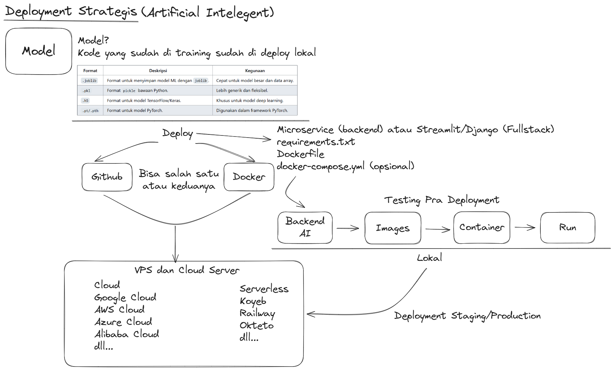

# Model Sentiment Analysis Google Cloud Deployment

- [Model Sentiment Analysis](https://github.com/Muhammad-Ikhwan-Fathulloh/Advanced-Machine-Learning-Course/tree/main/KNN)
- [Google Cloud Run](https://cloud.google.com/run?hl=id)
- [Database MySQL](https://freedb.tech/)

# Membaca Model Machine Learning dengan Microservice

## Format File Model Machine Learning

| **Format**  | **Deskripsi**                             | **Kegunaan**                          |
|-------------|-------------------------------------------|----------------------------------------|
| `.joblib`   | Format untuk menyimpan model ML dengan `joblib`. | Cepat untuk model besar dan data array. |
| `.pkl`      | Format `pickle` bawaan Python.            | Lebih generik dan fleksibel.          |
| `.h5`       | Format untuk model TensorFlow/Keras.      | Khusus untuk model deep learning.     |
| `.pt/.pth`  | Format untuk model PyTorch.               | Digunakan dalam framework PyTorch.    |

# Sentiment Analysis API

```
git clone https://github.com/Muhammad-Ikhwan-Fathulloh/Model-Sentiment-Analysis-Google-Cloud-Deployment.git
```

## Install Library dependencies

```
flask==2.3.3
flask-jwt-extended==4.4.4
flask-cors==3.0.10
mysql-connector-python==8.1.0
werkzeug==2.3.7
joblib==1.3.2
scikit-learn==1.5.1
gunicorn==20.1.0
numpy==1.23.5
```

```
pip install -r requirements.txt
```

## Deployment Strategis



## Deployment

Instructions for running the model in docker

```
docker build -t sentiment-analysis-app .
docker run -d -p 8080:8080 sentiment-analysis-app
```

The instruction looks at running containers

```
docker ps
```

Push Docker Hub

```
docker build . -t your_username_docker/sentiment-analysis-app
docker login
docker push your_username_docker/sentiment-analysis-app
```
